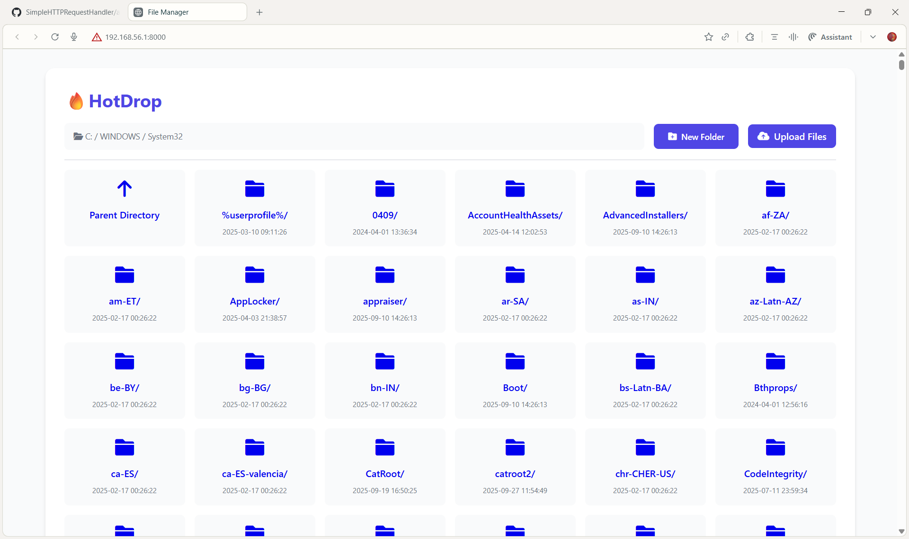

# SimpleHTTPRequestHandler

**Advanced Python HTTP File Manager and API for Modern File Operations**

***

## Table of Contents

- [About](#about)
- [Demo](#demo)
- [Features](#features)
- [Tech Stack](#tech-stack)
- [Architecture](#architecture)
- [Setup & Installation](#setup--installation)
- [Configuration](#configuration)
- [Usage](#usage)
    - [Running the Server](#running-the-server)
    - [API Endpoints](#api-endpoints)
    - [Web Interface](#web-interface)
- [Security](#security)
- [Extending](#extending)
- [Troubleshooting](#troubleshooting)
- [Contributing](#contributing)
- [License](#license)
- [Contact](#contact)

***

## About

**SimpleHTTPRequestHandler** is a robust, production-ready Python HTTP server, built using only the standard library. It lets you explore, upload, rename, and delete files and folders directly from your browser or command line using HTTP verbs.

- Elegant file manager interface with responsive design, powered by built-in HTML and JavaScript
- REST API for automation and scripting
- Secure, performant, and modular

***

## Demo



  
*Sample File Manager Interface - Desktop*

***

## Features

- **Directory Listing**: Clean, sortable folder view with metadata
- **File Upload**: Drag-and-drop or HTTP POST (multi-file support)
- **File Download**: Click any file to download (GET)
- **Folder Navigation**: Parent directory, subfolders, breadcrumbs
- **Rename/Move**: PATCH request to change names
- **Delete**: DELETE support for files/folders
- **Real-time UI**: Progress bar, live file updates via JavaScript
- **Error Handling**: Custom error messages and consistent status codes
- **Security**: Prevents traversal, enforces safe operations, configurable root
- **Modern UX**: Grid layout, icons, theming, mobile responsive

***

## Tech Stack

- **Language**: Python 3.7+
- **Libraries**: Only standard library (`http.server`, `os`, `json`, `cgi`, `datetime`, `urllib`)
- **Frontend**: HTML, CSS (FontAwesome), vanilla JavaScript

***

## Architecture

- **FileManagerHandler**: Extends Python's `SimpleHTTPRequestHandler` for custom HTTP verb logic
- **RESTful Endpoints**: Each file/folder operation is mapped to a corresponding HTTP method
- **Template Rendering**: Dynamic HTML grid/table, progress, and action menus
- **State Management**: Stateless API, UI updates handled client-side
- **Error Reporting**: JSON and HTML feedback for both API and browser usage

***

## Setup & Installation

```bash
# Clone the repo
git clone https://github.com/ayush-thakur02/SimpleHTTPRequestHandler.git
cd SimpleHTTPRequestHandler

# (Optional) Create a virtual environment
python3 -m venv venv
source venv/bin/activate

# Run the server
python app.py
```

#### Requirements

- Python 3.7+
- No external dependencies

***

## Configuration

Customize the following parameters in **app.py** for your needs:

- **port**: Change the server port in `run(port=8000)`
- **handler_class**: Extend `FileManagerHandler` for new logic
- **server_class**: Use alternative server classes for concurrency (e.g., `ThreadingTCPServer`)

***

## Usage

### Running the Server

```bash
python app.py
```
Visit [http://localhost:8000/](http://localhost:8000/) in your browser.

### API Endpoints

All endpoints reflect file/folder structure relative to the server root.

| Verb    | Endpoint               | Description                      | Payload                  |
| ------- | ---------------------- | -------------------------------- | ------------------------ |
| GET     | `/path/`               | List directory / download file   | None                     |
| POST    | `/path/`               | Upload file(s) to directory      | Multipart (`files[]`)    |
| PATCH   | `/path/`               | Rename file/folder               | JSON `{newName: ...}`    |
| DELETE  | `/path/`               | Delete file / empty folder       | None                     |

- **Upload Example:**
    ```bash
    curl -F "files[]=@yourfile.txt" http://localhost:8000/
    ```

- **Rename Example:**
    ```bash
    curl -X PATCH -H "Content-Type: application/json" -d '{"newName": "renamed.txt"}' http://localhost:8000/yourfile.txt
    ```

- **Delete Example:**
    ```bash
    curl -X DELETE http://localhost:8000/yourfile.txt
    ```

### Web Interface

- **Drag-and-drop, select files for upload**
- **Rename/Delete via right-click/actions**
- **Breadcrumb navigation**
- **Live server time and user display**

***

## Security

- **Root Restriction**: All operations are limited to the server directory tree
- **Traversal Protection**: No access outside root via path normalization
- **Safe Rename/Delete**: Prevent overwrite of critical files, checks for existence
- **Permissions**: Handles read/write failures gracefully

***

## Extending

To add authentication, logging, access control, or new endpoints, subclass `FileManagerHandler`:

```python
class CustomHandler(FileManagerHandler):
    # override do_GET, do_POST, etc.
```
Or plug in to a WSGI/ASGI container for enterprise deployments.

***

## Troubleshooting

- **File upload fails**: Check browser/devtools for error response; file size or permissions issue.
- **Delete fails**: Can only delete empty folders (extend for recursive if needed).
- **Port in use**: Change the port in the app or kill previous server.

***

## Contributing

1. Fork the repository
2. Create your feature branch
3. Commit changes (with appropriate messages)
4. Open a pull request

Please ensure code style matches the project standards. Add tests for new functionality if possible.

***

## License

MIT License. Feel free to use, modify, and distribute.

***

## Contact

Ayush Thakur  
Email: ayush.th2002@gmail.com  
GitHub: [ayush-thakur02](https://github.com/ayush-thakur02)
